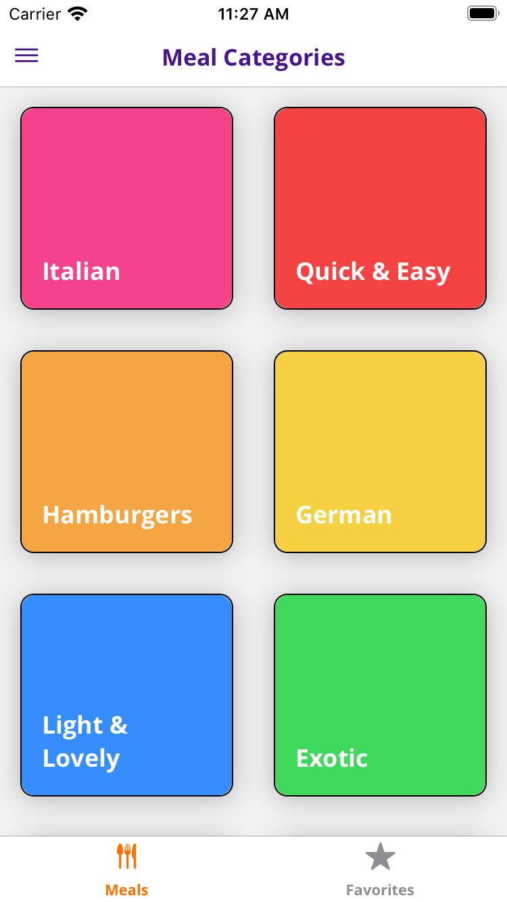
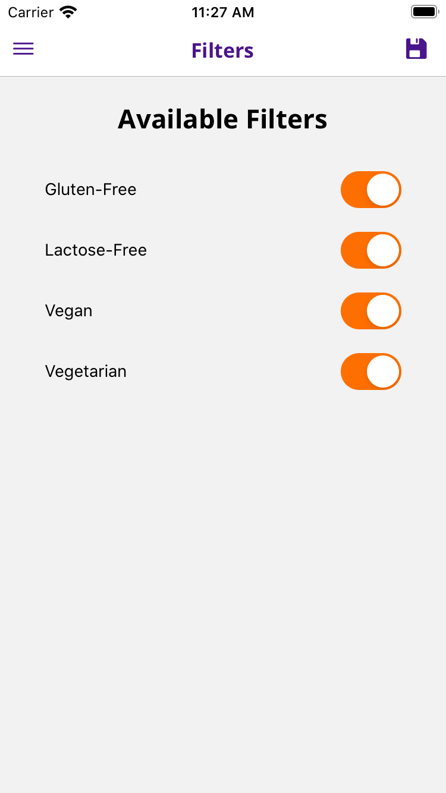
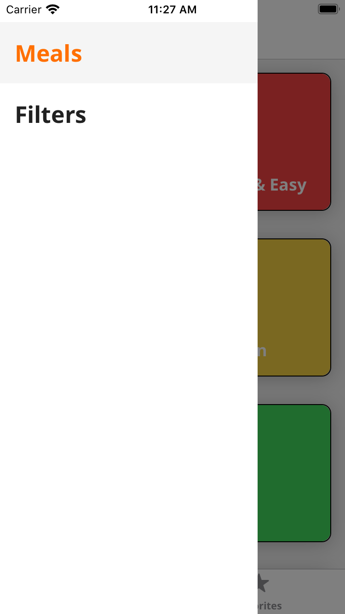
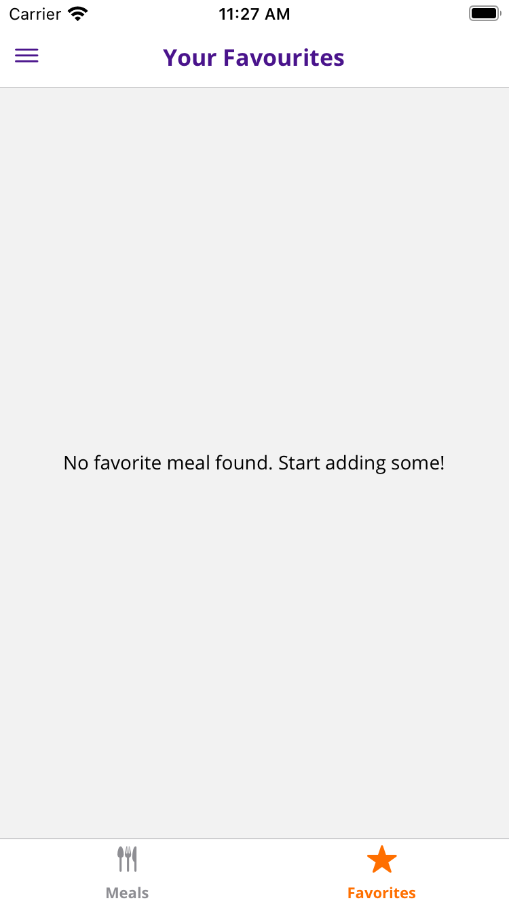

# Food App

<p float="left">
 
 
 

</p>

By [Balazs Danyadi](mailto:balazs.danyadi@gmail.com)

Lecture - [React Native - The Practical Guide](https://www.udemy.com/course/react-native-the-practical-guide/) on Udemy by Maximilian Schwarzmüller

## Instructions

1. Clone or download the repository

```javascript
git clone git@github.com:Balazs-D/Food-App.git
```

2. Get into the directory

```javascript
cd food-app
```

3. Install dependencies using

```javascript
npm install
```

4. Run the application

```javascript
npm start
```

5. Navigate to app in [browser](http://localhost:3000)

## Used Technologies

- React Native
- Redux

## Requirements

- Browse recipes by categories
- Add / remove recipes to / from favorites
- Browse favorites recipes
- Use filters

## Preview
